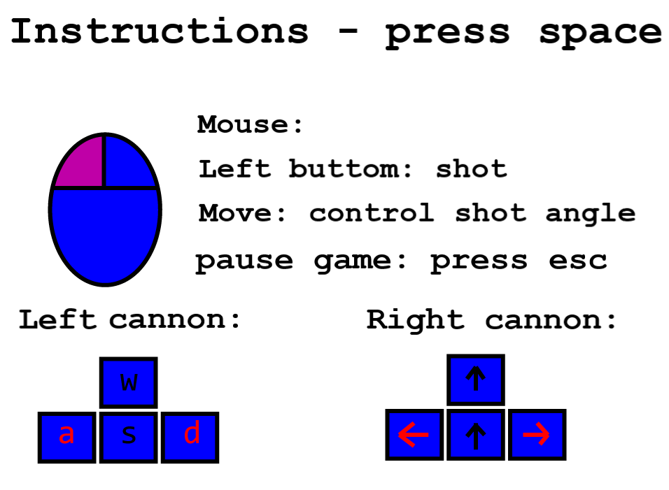

# LCOM 19/20

This is a repository contaning studies, labs and projects from LCOM lectures.  
Project and labs done with Allan Sousa.  
__Final grade: 18__  
__Test grade: 16.8__
Subject Goals: [link](https://sigarra.up.pt/feup/en/ucurr_geral.ficha_uc_view?pv_ocorrencia_id=436435)

# Labs 

|Lab | Grade |
|---|---|
| [lab2](lab2/) | 98 |
| [lab3](lab3/) | 95 |
| [lab4](lab4/) | 91 |
| [lab5](lab5/) | 78 |

# Final Project

__Project grade: 16.75__ 

[Report](proj/doc/report/report.pdf)
Here are some images of the game. For more details read the report.  

  

